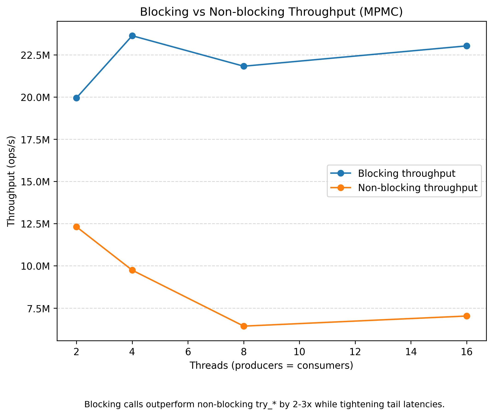

[](https://github.com/grudshtein/mpmc-ring/actions/workflows/ci.yml)


# MPMC Ring
MPMC Ring is a high-performance, bounded multi-producer/multi-consumer ring buffer for C++20.
It provides a work-conserving blocking (ticketed) path and a non-blocking `try_*` API,
uses atomic operations (no mutexes), and targets low-latency inter-thread messaging.
The library is header-only and ships with benchmarks and tests for reproducibility.

## Overview
Bounded multi-producer / multi-consumer ring buffer with:
- Blocking, ticketed fast path and non-blocking `try_*` API
- No mutexes; uses atomic operations. 
- Per-slot acquire/release handoff; relaxed cursors
- Thread pinning and cursor padding; reproducible bench with CSV output

## API
- `try_push(const T&) / try_push(T&&)`: non-blocking; returns `false` if full
- `push(const T&) / push(T&&)`: blocking (spins) until enqueued
- `try_pop(T&)`: non-blocking; returns `false` if empty
- `pop(T&)`: blocking (spins) until dequeued
- Template: `MpmcRing<T, /*Padding=*/bool>` (cursor padding toggle). Owns bounded storage.
  
Full signatures: see [`include/mpmc.hpp`](../include/mpmc.hpp).

## Build

### Visual Studio (Windows)
1. Open the folder as a **CMake Project**.
2. Set **x64 | Release**.
3. Run `tests` or `bench`.

Typical paths:
- `out/build/msvc-ninja-release/tests.exe`
- `out/build/msvc-ninja-release/bench.exe`

### MSYS2 / MinGW
```bash
cmake --preset=mingw-release
cmake --build --preset=mingw-release -j
./out/build/mingw-release/bench
```

## Benchmark defaults
**Benchmark defaults:** producers=consumers=1, capacity=65,536, mode=blocking, warmup=2,500 ms, duration=17,500 ms, 
bucket_width=5 ns, buckets=4,096, padding=on, pinning=on, large_payload=off, move_only_payload=off.

**Testbed:** Windows 11 (24H2)
**CPU:** Intel Core i7-11800H (8c/16t)
**Compiler:** MSVC 19.44 (Visual Studio 2022 17.10), `/O2 /GL`  
**Build system:** CMake 4.1.1 + Ninja 1.11.1 (Release) 
**Power plan:** Legion Balance Mode (OEM Balanced)

### Reproduce a 4p4c run
```bash
# Blocking (defaults)
./out/build/mingw-release/bench --producers 4 --consumers 4

# Non-blocking A/B
./out/build/mingw-release/bench --producers 4 --consumers 4 --blocking off
```
See `--help` for all options and defaults.

## Results (summary):
**Figure settings (used for all charts unless stated):** 
producers=consumers=4, capacity=65,536, mode=blocking, warmup=2,500 ms, duration=17,500 ms, 
bucket_width=5 ns, buckets=4,096, padding=on, pinning=on, large_payload=off, move_only_payload=off.




### Blocking vs non-blocking:
At 4p4c, blocking outperforms non-blocking by ~2–3× on this host, while tightening p99/p999.
### Pinning and padding:
Materially reduce tail latency.
### Payload sensitivity:
Large copyable payloads pay for data movement; move-only payloads keep latency close to small POD.
### Concurrency:
As threads increase, p50, p99, and p999 grow.

### Throughput notes:
- On this Windows testbed, total throughput plateaued by 4p4c despite the ticketed fast path. 
- Explicit thread pinning (affinity APIs) did not change the result. 
- Blocking is ~2–3× faster than non-blocking at 4p4c, and pinning/padding primarily tighten tails. 
- On a single-socket Linux host, higher scaling is expected.
- Next steps for increased performance: sharding the queue (N sub-rings).